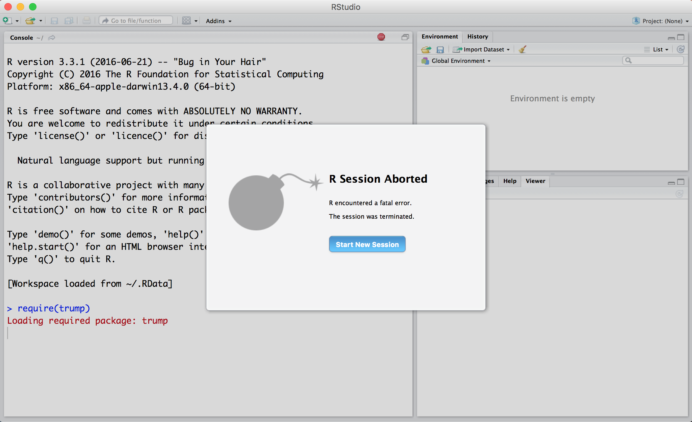

# Instantly segfault your R session

```
require(trump)
```

This will instantly segfault your R session. Is that useful, probably not, but so what. 

The [](https://travis-ci.org/romainfrancois/trump) badge is expected. 

## Installing 

`trump` probably will never go to CRAN, but then again you never know, in the meantime you can install it from github using 

```
install_github("romainfrancois/trump", args = "--no-test-load" )
```

## on the console 

```
> require(trump)
Loading required package: trump

 *** caught illegal operation ***
address 0x100807fb4, cause 'illegal opcode'

Traceback:
 1: .C("trump")
 2: fun(libname, pkgname)
 3: doTryCatch(return(expr), name, parentenv, handler)
 4: tryCatchOne(expr, names, parentenv, handlers[[1L]])
 5: tryCatchList(expr, classes, parentenv, handlers)
 6: tryCatch(fun(libname, pkgname), error = identity)
 7: runHook(".onAttach", ns, dirname(nspath), nsname)
 8: attachNamespace(ns, pos = pos, deps)
 9: doTryCatch(return(expr), name, parentenv, handler)
10: tryCatchOne(expr, names, parentenv, handlers[[1L]])
11: tryCatchList(expr, classes, parentenv, handlers)
12: tryCatch(expr, error = function(e) {    call <- conditionCall(e)    if (!is.null(call)) {        if (identical(call[[1L]], quote(doTryCatch)))             call <- sys.call(-4L)        dcall <- deparse(call)[1L]        prefix <- paste("Error in", dcall, ": ")        LONG <- 75L        msg <- conditionMessage(e)        sm <- strsplit(msg, "\n")[[1L]]        w <- 14L + nchar(dcall, type = "w") + nchar(sm[1L], type = "w")        if (is.na(w))             w <- 14L + nchar(dcall, type = "b") + nchar(sm[1L],                 type = "b")        if (w > LONG)             prefix <- paste0(prefix, "\n  ")    }    else prefix <- "Error : "    msg <- paste0(prefix, conditionMessage(e), "\n")    .Internal(seterrmessage(msg[1L]))    if (!silent && identical(getOption("show.error.messages"),         TRUE)) {        cat(msg, file = stderr())        .Internal(printDeferredWarnings())    }    invisible(structure(msg, class = "try-error", condition = e))})
13: try({    attr(package, "LibPath") <- which.lib.loc    ns <- loadNamespace(package, lib.loc)    env <- attachNamespace(ns, pos = pos, deps)})
14: library(package, lib.loc = lib.loc, character.only = TRUE, logical.return = TRUE,     warn.conflicts = warn.conflicts, quietly = quietly)
15: doTryCatch(return(expr), name, parentenv, handler)
16: tryCatchOne(expr, names, parentenv, handlers[[1L]])
17: tryCatchList(expr, classes, parentenv, handlers)
18: tryCatch(library(package, lib.loc = lib.loc, character.only = TRUE,     logical.return = TRUE, warn.conflicts = warn.conflicts, quietly = quietly),     error = function(e) e)
19: require(trump)

Possible actions:
1: abort (with core dump, if enabled)
2: normal R exit
3: exit R without saving workspace
4: exit R saving workspace
Selection:
```

## In RStudio



